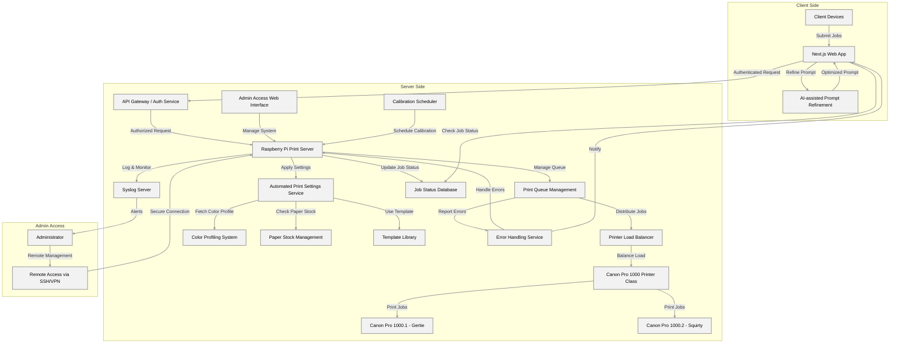

# Print Server Overview

## Introduction

The Print Server, implemented on a Raspberry Pi, serves as the core of the advanced printing system. It manages print jobs, coordinates various services, and interfaces with the printers. This overview will detail its key features, responsibilities, and interactions with other system components.

## Key Features

1. **Centralized Job Management**: Handles all incoming print jobs from the web application.
2. **Printer Control**: Directs print jobs to the appropriate Canon Pro 1000 printers.
3. **Integration Hub**: Coordinates between various services like queue management, load balancing, and print optimization.
4. **Security**: Manages authentication and authorization for print jobs and admin access.
5. **Monitoring and Logging**: Tracks system status and logs events for troubleshooting and analysis.

## Core Responsibilities

### 1. Job Processing
- Receives authenticated print jobs from the API Gateway
- Applies automated print settings to each job
- Manages the print queue and job prioritization

### 2. Printer Management
- Communicates with Canon Pro 1000 printers
- Monitors printer status (online/offline, ink levels, paper supply)
- Triggers maintenance routines and calibrations

### 3. Service Coordination
- Interacts with the Automated Print Settings Service for job optimization
- Coordinates with the Printer Load Balancer for efficient job distribution
- Updates the Job Status Database in real-time

### 4. Error Handling
- Detects and logs printer and job errors
- Communicates with the Error Handling Service for issue resolution
- Initiates job reruns or reroutes as necessary

### 5. Admin Interface
- Provides a web-based admin interface for system management
- Supports remote access via SSH/VPN for maintenance and troubleshooting

### 6. Data Management
- Manages color profiles and templates
- Tracks paper stock and consumables inventory

## Interactions with Other Components

- **Next.js Web App**: Receives print jobs and sends status updates
- **API Gateway / Auth Service**: Ensures all incoming requests are authenticated and authorized
- **Print Queue Management**: Organizes and prioritizes print jobs
- **Printer Load Balancer**: Determines optimal printer assignment for each job
- **Automated Print Settings Service**: Applies appropriate settings for each print job
- **Color Profiling System**: Ensures color accuracy across different media types
- **Paper Stock Management**: Checks and updates paper inventory
- **Template Library**: Applies predefined templates to print jobs
- **Job Status Database**: Keeps real-time records of all job statuses
- **Error Handling Service**: Manages system errors and initiates recovery procedures
- **Syslog Server**: Centralizes logging for system events and diagnostics
- **Calibration Scheduler**: Manages regular printer calibration tasks

## Technical Specifications

- **Hardware**: Raspberry Pi 4 (8GB RAM model recommended)
- **Operating System**: Raspberry Pi OS (64-bit)
- **Primary Language**: Node.js
- **Database**: MongoDB for job data, Redis for caching
- **Printer Communication**: CUPS (Common Unix Printing System)
- **API**: RESTful API implemented with Express.js
- **Security**: OAuth 2.0 for authentication, HTTPS for all communications

## Scalability and Performance

- Capable of managing multiple high-end printers simultaneously
- Optimized for handling large, high-resolution print jobs
- Scalable architecture allows for easy addition of new printers or services

## Future Enhancements

- Implementation of machine learning for predictive maintenance
- Integration with cloud services for expanded processing capabilities
- Support for additional printer models and brands