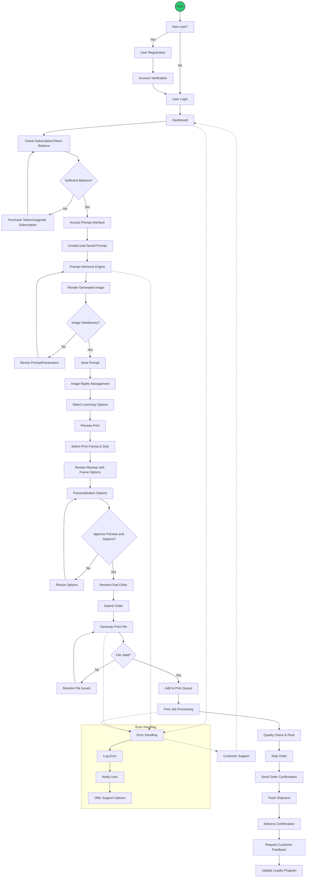

# Prompt-to-Print Business Model Workflow

## Overview

This repo contains code & documentation for Gener8or Studios' prompt-to-print business model. The system allows users to generate custom art using AI, customize it, and order high-quality prints on-the-spot. This README provides a comprehensive guide to the workflow.

## Table of Contents

0. [Completed Features](#completed-features)
1. [System Architecture](#system-architecture)
2. [Key Features](#key-features)
3. [User Journey](#user-journey)
4. [Technical Implementation](#technical-implementation)
5. [Security Considerations](#security-considerations)
6. [Scalability](#scalability)
7. [Maintenance and Support](#maintenance-and-support)
8. [Future Enhancements](#future-enhancements)

## System Architecture

The prompt-to-print workflow is built on a modular architecture that integrates various components:

- User Authentication System
- AI Image Generation Engine
- E-commerce Platform
- Print Production Management System
- Shipping and Logistics Integration
- Customer Relationship Management (CRM) System

## Completed Features:
- **Authentication Provider** Integrated Netlify Identity for user authentication, session management, role-based access controls (using JWT) 
- **Inference Engine** Integrated the FAL.ai Node.js SDK with Proxy Mode configured to protect API keys in production
- **Image Rendering** Successfully generated and displayed images in the Next.js UI 
- **Inference Optimization** Slashed inference time and cost by switching to Flux.1|Dev model after testing with Flux.1|Pro
- **Model Selector** Implemented drop-down selector for Flux.1|Pro & Flux.1|Dev model options
- [**ENHANCE**] Created Image Upscaler Component (needs to be integrated into print order flow)
- **Print Previewer** Added a print preview page with page, size, and format selector
- **Token Store** Added a payments page with an option to purchase prompt, print, and upscale tokens. 
- **Updated Pricing Model** to Gigatokens (1B tokens) & Gigapixels (1B pixels)
- **UI/UX** Structured site/sidebar layout with `Prompt`, `Print`, and `Pay` sections
- **CSS Styling** Custom image loading animations and hover effects
- **Square Web Payments API** Successfully integrated Square Web Payments API 
- **Integrated Print Preview & Order Flow Tool** into a single component with a dynamically created mock-up of the generated image with tabs for Size, Quantity, Pricing and Resolution customization options.
- **Integrated Caching Mechanism** - generated images are cached in local storage and reloaded when the user navigates back to the page.

## Key Features

1. **User Management**: Registration, login, and profile management.
2. **Subscription/Token System**: Flexible payment options for users.
3. **AI-Powered Image Generation**: Advanced prompt interface with parameter adjustments.
4. **Image Rights Management**: Licensing options and rights clearance.
5. **Print Customization**: Size, format, framing, and personalization options.
6. **Order Processing**: Streamlined checkout and order review.
7. **Quality Assurance**: Automated file validation and manual quality checks.
8. **Shipping Integration**: Real-time tracking and delivery confirmation.
9. **Customer Engagement**: Feedback collection and loyalty program.
10. **Error Handling**: Robust system for managing and resolving issues.
11. **Customer Support**: Integrated support options throughout the workflow.

## User Journey

1. **Onboarding**: New users register and verify their accounts.
2. **Access**: Users log in and are directed to a central dashboard.
3. **Resource Check**: System verifies subscription status or token balance.
4. **Image Creation**: Users create or load prompts to generate images.
5. **Customization**: Generated images can be revised, and print options selected.
6. **Licensing**: Users choose appropriate licensing for their generated images.
7. **Order Review**: Final review of the product and options before purchase.
8. **Production**: Order is processed, printed, and quality-checked.
9. **Delivery**: Order is shipped with tracking information provided.
10. **Follow-up**: System requests feedback and updates loyalty program.

## Technical Implementation

### Frontend
- Next.js for the user interface

### Backend
- Node.js with Express.js
- Postgres SQL for user data and order information
- Redis for caching and session management

### AI Integration
- Integration with cloud-based AI services (e.g., OpenAI API, FAL.ai SDK) for AI inference

### Payment Processing
- Square Web Payments API for secure payment handling

### Print Production
- Custom print job management system for fine art prints
- Integration with professional printing hardware APIs for streamlined production

### Shipping
- Integration with major shipping carrier APIs (UPS, FedEx, DHL), managed through Shipstation or Printful

## Security Considerations

- Implement OAuth 2.0 for secure authentication
- Use HTTPS for all communications
- Employ rate limiting to prevent abuse
- Regularly update and patch all systems
- Implement robust data encryption for sensitive information
- Conduct regular security audits and penetration testing

## Scalability

- Utilize containerization (Docker) for easy scaling
- Implement load balancing for high-traffic periods
- Use a content delivery network (CDN) for static assets
- Design with microservices architecture for independent scaling of components

## Maintenance and Support

- Set up comprehensive logging and monitoring (e.g., ELK stack)
- Implement an automated ticketing system for customer support
- Create a knowledge base for common issues and FAQs
- Establish a regular maintenance schedule for all system components

## Future Enhancements

- AI-assisted prompt suggestions
- AR/VR preview of prints in a user's space
- Integration with social media for sharing and viral marketing
- Expansion into additional product types (e.g., merchandise, digital downloads)
- Implementation of a creator marketplace for prompt sharing and monetization

## Future Enhancements (ajm)
- Core Functionality to Reach MVP:
    1. User can securely authenticate via Netlify Identity and manage their account
    2. User can purchase credits via Square Web Payments API
    3. User can generate images via FAL.ai (only if they have prompt tokens)
    4. System can store user account & token data in PostgreSQL database (or similar)
    4. User can preview the generated image as a mock-up in their browser
    5. User can submit a print order to the OMS (Order Management System)
    6. System can send print order details to cloud print server (CUPS or Paperclip) (only if they have print tokens)
    7. Print server can process the print order and send it to the Canon Pro 1000 Printer
    8. Shipstation or Printful can handle the shipping and logistics for the print order

- Deploy to Netlify or Vercel (fix legacy dependencies build issue)
- Integrate with a Cloud Print Server connected to Canon Pro 1000 Printer (CUPS or Papercut Mobility Print) - look into Cloudflare Tunnels for Secure Remote Access
- Add more image generation options (guidance (cfg) scale and image size - "square_hd", "square", "portrait_4_3", "portrait_16_9", "landscape_4_3", "landscape_16_9") 
- Custom proxy logic for FAL.ai Inference Engine optimization - rate limits, content moderation, prompt-hijack protection, etc. 
- Integrate OpenAI models & APIs for auto-prompt refinement, customer support, and other multi-modal AI capabilities 
- Improve the polish of the UI
---

## Tips 

- **User Interface (UI) Flow**: The UI should guide the user intuitively through each step, from creating or selecting their image to finalizing the print. Keeping the design clean, with clear progression indicators (like steps or a wizard format), can help users feel confident in where they are in the process.
- **Real-Time Feedback**: Provide instant visual feedback as users tweak their digital creations. For example, as they adjust parameters (like colors, sizes, or filters), show them in real-time how these changes will affect the final print.
- **Preview and Mockups**: Before printing, offer a high-quality preview that simulates how the final product will look, including mockups of the image within a frame or on different materials.
- **Seamless Backend Integration**: Ensure that once a user hits "Print," the process on the backend is automated and reliable. This might involve integrating your Next.js app with a print server (like the Raspberry Pi setup you're considering) that queues and processes print jobs efficiently.
- **Personalization Options**: Allow users to make the experience more personal, whether through custom print sizes, paper types, or other finishing options. But keep it simple—offer a curated set of choices that don't overwhelm the user.
- **Consistent Design Language**: Maintain a consistent design language across the digital interface and physical products. This includes color schemes, typography, and branding elements.
- **Post-Print Experience**: Provide the user with care instructions, framing suggestions, or even a note about the artist or process behind the creation after the print is complete.

